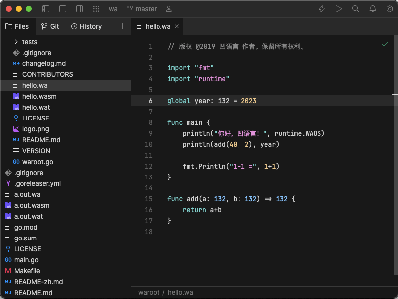

# JetBrains Fleet 凹语言插件

本仓库是 [JetBrains Fleet](https://www.jetbrains.com.cn/fleet) 凹语言插件，用于支持凹语言语法高亮等特性。凹语言™（凹读音“Wa”）是 针对 WASM 平台设计的的通用编程语言，支持 Linux、macOS 和 Windows 等主流操作系统和 Chrome 等浏览器环境，同时也支持作为独立Shell脚本和被嵌入脚本模式执行。主页 (Homepage): [https://wa-lang.org](https://wa-lang.org)

首先克隆本仓库到本地，然后将 `Wa.tmbundle` 子目录复制到 `$HOME/.fleet/textmate` 目录下（具体细节可以参考 [TextMate bundles](https://www.jetbrains.com/help/fleet/textmate.html) 文档）。

然后重启 Fleet，打开 [hello.wa](hello.wa) 文件，效果如下图：

目前只有高亮基本功能，后面会逐步完善。
